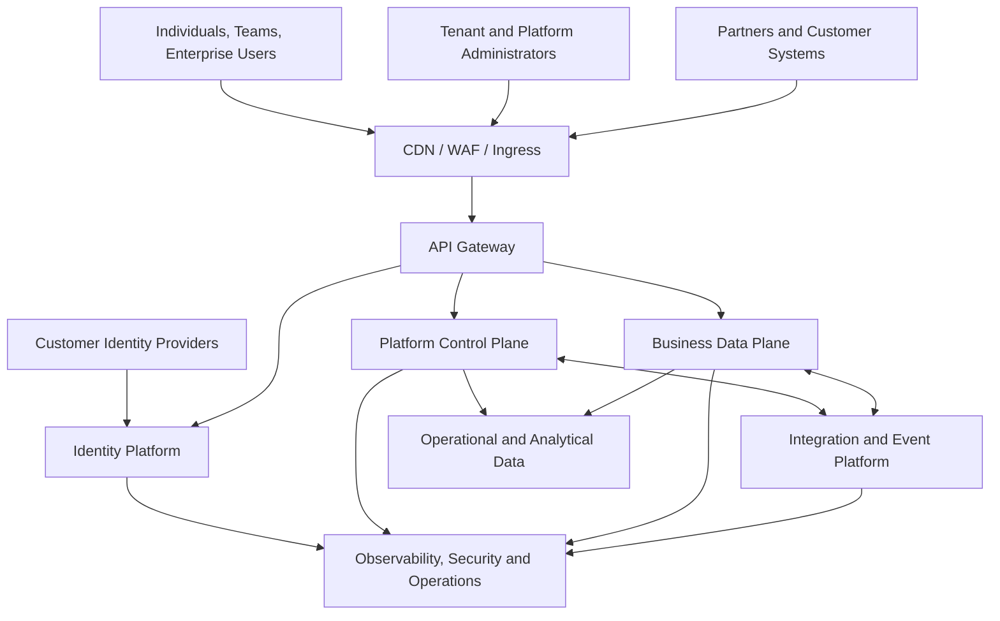
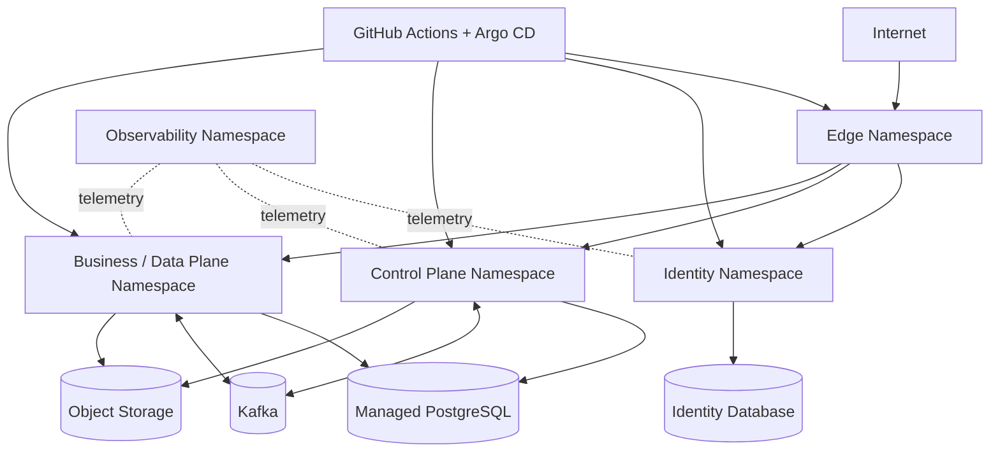

# Enterprise Architecture

**Document ID:** EA-001  
**Version:** 1.0  
**Status:** Approved  
**Owner:** Chief Architect

## 1. Executive Summary

The Cloud Native AI Platform (CNAP) is a reusable, multi-tenant, cloud-native platform for building secure SaaS and AI-enabled products. It separates customer-facing business capabilities from shared platform capabilities and establishes explicit control-plane, data-plane, security, data, integration, and operations layers.

The initial implementation remains pragmatic: modular-first, API-first, Kubernetes-ready, observable, and secure by default. Independent services are introduced only when scaling, ownership, release cadence, resilience, or isolation requirements justify extraction.

## 2. Business Drivers

- Faster delivery of SaaS products.
- Reusable identity, tenancy, audit, notification, workflow, and observability capabilities.
- Enterprise customer onboarding and identity federation.
- Secure multi-tenant operation.
- Cloud portability and automated delivery.
- AI enablement without coupling domain services to individual model providers.
- Compliance, supportability, resilience, and cost transparency.

## 3. Architecture Vision

> Provide a governed platform that enables product teams to deliver secure, observable, tenant-aware, AI-ready applications through reusable capabilities and a paved engineering road.

## 4. Scope

### In scope

- Web, mobile, administrator, partner, and machine access.
- Identity and access management.
- Tenant lifecycle and isolation.
- Subscription, entitlement, configuration, audit, notification, workflow, and usage capabilities.
- Domain applications such as DeepFocus.
- Kubernetes delivery, GitOps, observability, security, and data governance.
- Governed AI services, RAG, evaluation, and agent workflows.

### Out of scope for the first release

- Active-active global deployment.
- Dedicated infrastructure for every tenant.
- Unrestricted plugin execution.
- Fully autonomous AI changes to business state.
- Premature decomposition into many microservices.

## 5. Architecture Style

The platform combines:

- Domain-Driven Design for ownership boundaries.
- Modular monoliths for early delivery.
- Selective microservices for independently evolving capabilities.
- REST for synchronous request-response interactions.
- Events and durable workflows for asynchronous or long-running processes.
- Zero Trust for human and workload communication.
- Platform engineering for reusable standards and self-service delivery.

## 6. Enterprise Context

## 7. Capability Layers

### Experience layer

- Web application.
- Mobile application.
- Tenant administration portal.
- Platform administration portal.
- Developer and partner APIs.

### Access and edge layer

- CDN, WAF, DDoS protection.
- Ingress and load balancing.
- API gateway.
- Authentication entry points.
- Rate limits, request validation, and correlation.

### Identity and trust layer

- Keycloak.
- Organizations and identity brokering.
- OIDC, OAuth 2.0, SAML, MFA, and session management.
- Human, workload, integration, and privileged identities.

### Control plane

- Tenant registry and lifecycle.
- Subscription and entitlement.
- Tenant identity-provider configuration.
- Provisioning workflows.
- Configuration and feature management.
- Usage and support administration.

### Data plane

- Focus, task, collaboration, analytics, knowledge, automation, and AI-facing domain APIs.
- Customer workflows and background processing.
- Tenant-owned operational data.

### Shared platform services

- Audit.
- Notifications.
- Workflow and scheduling.
- Configuration and feature flags.
- Metering and quotas.
- Integration and webhook delivery.

### Data platform

- PostgreSQL for transactional data.
- Redis for bounded caching and rate enforcement.
- Kafka for durable integration events.
- S3-compatible object storage.
- pgvector initially for vector retrieval.
- Governed analytical stores when required.

### Operations and governance

- OpenTelemetry, Prometheus, Grafana, Loki, and Tempo.
- Secrets and key management.
- Security monitoring and SIEM integration.
- CI/CD, GitOps, policy enforcement, backup, restore, and disaster recovery.

## 8. Control Plane and Data Plane

### Control plane responsibilities

- Create, activate, suspend, migrate, and delete tenants.
- Manage plans, subscriptions, entitlements, quotas, and feature access.
- Configure enterprise identity providers and tenant administrators.
- Coordinate provisioning and deprovisioning.
- Provide controlled support and platform administration.

Control-plane privileges are isolated from customer data-plane traffic and require stronger authorization, auditing, and operational controls.

### Data plane responsibilities

- Execute customer business operations.
- Process domain commands and queries.
- Run tenant-specific jobs and integrations.
- Persist tenant-owned business data.
- Publish domain and integration events.

The two planes may initially share clusters or runtime infrastructure, but remain logically, operationally, and authorization-wise distinct.

## 9. Authoritative Systems

| Concept | Authority |
|---|---|
| Authentication and sessions | Keycloak |
| Internal tenant identity and lifecycle | Tenant context |
| Organization representation | Keycloak, synchronized from tenant authority |
| Subscription state | Subscription context |
| Feature access and limits | Entitlement context |
| Domain data | Owning bounded context |
| Audit evidence | Audit platform |
| Usage measurements | Metering capability |
| Deployment desired state | Git repositories |

## 10. Deployment Architecture

Managed databases, object storage, secrets managers, and messaging services are preferred in production where they reduce undifferentiated operational work.

## 11. Environment Strategy

- Local developer environment.
- Development.
- Integration.
- Performance and resilience testing.
- Pre-production.
- Production.
- Disaster-recovery environment.

Production customer data is prohibited in lower environments unless irreversibly anonymized and explicitly approved.

## 12. Security Architecture Position

- Identity is the primary trust anchor.
- Internal network location does not establish trust.
- Gateway validation is not the sole security boundary.
- Every workload uses a dedicated identity and least-privilege permissions.
- Tenant membership and resource ownership are revalidated in domain services.
- Secrets never reside in source code, images, ConfigMaps, or unencrypted Helm values.
- Critical administration requires MFA, separation of duties, just-in-time access where possible, and complete audit trails.

## 13. Data Architecture Position

- Each bounded context owns its data and contracts.
- Shared physical infrastructure is permitted; uncontrolled shared logical ownership is not.
- Tenant-owned records carry immutable tenant identifiers.
- Isolation policies support shared schema, dedicated schema, dedicated database, and later dedicated deployments.
- Data classification, residency, retention, export, deletion, legal hold, and backup expiry are explicit policies.
- Analytics consumes governed events or replicated data products rather than directly coupling to operational schemas.

## 14. Integration Position

- APIs use versioned contracts, standard error models, idempotency, and correlation identifiers.
- Events have owners, versioned schemas, tenant context, replay policies, retention rules, and sensitive-data controls.
- Long-running provisioning and lifecycle operations use durable workflows.
- The outbox pattern is used where transactional state and event publication must remain consistent.
- Access and refresh tokens are never included in events.

## 15. Reliability and Scalability

- Stateless horizontal scaling for request-processing services.
- Multi-replica and multi-zone deployment for critical services.
- Timeouts, bounded retries, circuit breakers, bulkheads, backpressure, and dead-letter handling.
- Idempotency for commands and consumers.
- Explicit service tiers with differentiated SLO, RTO, and RPO targets.
- Noisy-neighbour controls through quotas, rate limits, workload isolation, and capacity governance.

## 16. Target Operating Model

| Area | Primary accountability |
|---|---|
| Enterprise architecture | Chief Architect and Architecture Review Board |
| Identity platform | Identity platform team |
| Tenant and shared control plane | Platform product team |
| Business domains | Stream-aligned product teams |
| Kubernetes and delivery platform | Platform engineering |
| Data platform and governance | Data platform team |
| Security and compliance | Security engineering |
| Reliability and incident management | SRE / operations |
| AI platform and governance | AI platform team |

Every production capability has a service owner, data owner, security owner, SLO owner, support path, and cost accountability.

## 17. Governance

Major decisions are governed through:

- Architecture principles.
- ADRs.
- Threat modelling.
- API and event reviews.
- Data classification and privacy reviews.
- Architecture fitness functions.
- Production-readiness reviews.
- Evidence from load, penetration, failover, restore, and resilience testing.

## 18. Evolution Roadmap

### Foundation

- Modular domain structure.
- Keycloak integration.
- Gateway, tenant context, PostgreSQL, basic audit, and OpenTelemetry.

### Product platform

- Subscription, entitlement, notifications, workflow, feature management, and usage metering.

### Enterprise identity and integration

- Customer OIDC and SAML, account-linking controls, webhooks, and integration connectors.

### Scale and isolation

- Dedicated data options, workload federation, stronger policy automation, regional placement, and enhanced DR.

### AI platform

- Model gateway, prompt registry, RAG, evaluation, traceability, agent orchestration, and human approval controls.

## 19. Risks and Treatments

| Risk | Treatment |
|---|---|
| Premature microservice complexity | Modular-first architecture and extraction criteria |
| Keycloak as a shared failure point | HA topology, capacity tests, recovery exercises |
| Cross-tenant access | Layered enforcement, tenant-aware repositories, RLS where appropriate, security tests |
| Platform-team bottleneck | Self-service templates, delegated ownership, product management |
| Event inconsistency | Outbox, schemas, idempotency, reconciliation |
| AI bypasses domain controls | Tool contracts, policy enforcement, approval workflows, audit |
| Observability cost growth | Sampling, retention tiers, cardinality controls, FinOps |
| Temporary designs become permanent | ADR review triggers and explicit exit criteria |

## 20. Approval Checklist

- [x] Business drivers and scope are explicit.
- [x] Control plane and data plane are separated.
- [x] Identity, tenancy, data, integration, and operations positions are defined.
- [x] Authoritative systems are identified.
- [x] Deployment and operating models are documented.
- [x] Evolution avoids premature distribution.
- [x] Risks and governance mechanisms are included.

## 21. Related Documents

- 01 Vision and Business Goals.
- 02 Business Capability Model.
- 04 Architecture Principles.
- 05 Architecture Decision Records.
- 06 Domain-Driven Design and Bounded Contexts.
