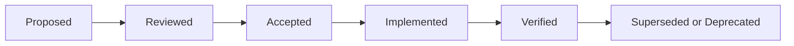

# Architecture Decision Records

**Document ID:** ADR-INDEX-001  
**Version:** 1.0  
**Status:** Approved  
**Owner:** Chief Architect

## 1. Purpose

This document records the foundational architecture decisions for the Cloud Native AI Platform. Each decision captures the selected direction, material alternatives, consequences, and the condition that should trigger review.

## 2. ADR Lifecycle

Accepted ADRs remain immutable historical records. A changed direction is captured by a new ADR that supersedes the previous decision.

## 3. Required ADR Fields

- Identifier and title.
- Status and owner.
- Context and decision drivers.
- Decision.
- Alternatives considered.
- Positive and negative consequences.
- Risks and mitigations.
- Implementation guidance.
- Verification evidence.
- Review trigger.

---

## ADR-001 — Adopt a modular-first architecture

**Status:** Accepted

**Decision:** Implement early capabilities as strongly isolated modules and extract independently deployable services only when scaling, release cadence, resilience, security, data isolation, or team ownership justify distribution.

**Alternatives:** monolith without boundaries; microservices from day one.

**Consequences:** lower initial operational complexity and faster refactoring, but disciplined module boundaries and architecture tests are mandatory.

**Review trigger:** sustained independent scaling or release needs, incompatible reliability requirements, or clear team autonomy constraints.

## ADR-002 — Use Domain-Driven Design for ownership boundaries

**Status:** Accepted

**Decision:** Use bounded contexts, ubiquitous language, aggregates, domain events, and explicit context relationships to define ownership.

**Alternatives:** technical-layer decomposition; database-first service decomposition.

**Consequences:** architecture aligns with business change, but domain modelling requires continuing product and engineering participation.

**Review trigger:** bounded contexts repeatedly change together or the language no longer matches the business.

## ADR-003 — Separate control plane and data plane logically

**Status:** Accepted

**Decision:** Separate platform administration and tenant lifecycle capabilities from normal customer business processing, even when they initially share infrastructure.

**Alternatives:** one undifferentiated application surface.

**Consequences:** stronger privilege isolation, clearer scaling and operational policies, and more explicit contracts.

**Review trigger:** control-plane operations materially interfere with data-plane availability or require physical isolation.

## ADR-004 — Use REST for bounded synchronous interactions

**Status:** Accepted

**Decision:** Use versioned REST APIs documented with OpenAPI for synchronous request-response interactions.

**Alternatives:** GraphQL as the default; RPC as the default.

**Consequences:** broad interoperability and simpler governance; clients may need composition endpoints or read models.

**Review trigger:** proven client composition or latency requirements cannot be met through REST and projections.

## ADR-005 — Use events and workflows for asynchronous processes

**Status:** Accepted

**Decision:** Use versioned integration events for decoupled notification and state propagation, and a durable workflow engine for long-running orchestration.

**Alternatives:** synchronous HTTP chains; database polling as the primary pattern.

**Consequences:** improved resilience and autonomy, with added eventual consistency, schema, replay, and operational complexity.

**Review trigger:** broker or workflow overhead outweighs reliability needs for a specific process.

## ADR-006 — Use Keycloak as the identity provider

**Status:** Accepted

**Decision:** Use Keycloak for authentication, sessions, OIDC, OAuth 2.0, SAML federation, MFA, and identity brokering.

**Alternatives:** Auth0, Cognito, Entra External ID, custom IAM.

**Consequences:** open and extensible identity capability with platform ownership for upgrades, hardening, capacity, recovery, and configuration governance.

**Review trigger:** support, scale, regulatory, or operating-cost requirements cannot be met sustainably.

## ADR-007 — Use one realm with Keycloak Organizations initially

**Status:** Accepted

**Decision:** Represent standard customers as Organizations within one primary realm. Dedicated realms remain an exceptional enterprise isolation option.

**Alternatives:** realm per tenant; single realm without Organizations.

**Consequences:** simpler operations and shared login experience, but careful organization membership, claim mapping, and tenant authority rules are required.

**Review trigger:** contractual isolation, configuration conflicts, realm scale, or customer-specific policies make shared operation unsuitable.

## ADR-008 — Keep tenant lifecycle authoritative outside Keycloak

**Status:** Accepted

**Decision:** The Tenant context owns internal tenant identity, lifecycle, region, isolation policy, and status. Keycloak contains a synchronized organization representation.

**Alternatives:** use Keycloak as the commercial and operational tenant registry.

**Consequences:** avoids coupling business lifecycle to identity representation but requires reliable provisioning and reconciliation.

**Review trigger:** none expected; changes require platform-wide approval.

## ADR-009 — Use layered authorization

**Status:** Accepted

**Decision:** Authorization combines caller authentication, token issuer and audience, service permission, tenant membership, tenant role, entitlement, resource ownership, and domain business rules.

**Alternatives:** gateway-only authorization; RBAC-only authorization.

**Consequences:** stronger security with additional policy design and testing responsibility.

**Review trigger:** policy complexity warrants a dedicated policy decision service.

## ADR-010 — Use OAuth client credentials for initial workload identity

**Status:** Accepted

**Decision:** Each workload receives a dedicated OAuth client and Kubernetes ServiceAccount. Client credentials are short-lived operational secrets until workload federation is proven.

**Alternatives:** shared backend client; static API keys; immediate service mesh identity only.

**Consequences:** practical initial M2M security, with secret rotation and eventual migration work.

**Review trigger:** workload federation is supported and validated in production.

## ADR-011 — Do not propagate user tokens indiscriminately

**Status:** Accepted

**Decision:** Propagate a user token only when downstream action genuinely requires user delegation. Use service identity, token exchange, or an on-behalf-of pattern for sensitive multi-hop calls.

**Alternatives:** forward the original access token across all services.

**Consequences:** reduced token exposure and clearer audiences, with more sophisticated identity flows.

**Review trigger:** adoption of a platform token-exchange standard.

## ADR-012 — Use Spring Cloud Gateway at the application edge

**Status:** Accepted

**Decision:** Use Spring Cloud Gateway for routing, authentication entry checks, rate enforcement, correlation, and edge policy integration. Domain authorization remains in services.

**Alternatives:** gateway implemented in each application; API management product only.

**Consequences:** consistent Java-based gateway capability but requires HA, performance tests, and protection against policy overload.

**Review trigger:** external API-product requirements justify a managed API-management layer.

## ADR-013 — Use tiered tenant data isolation

**Status:** Accepted

**Decision:** Support shared schema, dedicated schema, dedicated database, and later dedicated deployment through a tenant-to-storage policy.

**Alternatives:** one mandatory isolation model for all customers.

**Consequences:** commercial flexibility and migration complexity; all application contracts must remain isolation-model neutral.

**Review trigger:** new regulatory or scale constraints require an additional isolation tier.

## ADR-014 — Use PostgreSQL as the primary transactional database

**Status:** Accepted

**Decision:** Use PostgreSQL for platform and product transactional workloads, with logical ownership per bounded context.

**Alternatives:** MySQL, document database as default, distributed SQL from inception.

**Consequences:** mature ACID platform and extension ecosystem; scaling and tenant distribution require deliberate design.

**Review trigger:** measured workload characteristics exceed practical PostgreSQL architecture.

## ADR-015 — Use pgvector initially for vector retrieval

**Status:** Accepted

**Decision:** Use pgvector for initial embeddings and retrieval where scale and isolation fit PostgreSQL operations.

**Alternatives:** Milvus, Pinecone, Weaviate, OpenSearch vector engine.

**Consequences:** lower platform complexity and combined governance, but less specialized extreme-scale capability.

**Review trigger:** corpus size, latency, filtering, indexing, or operational isolation exceeds agreed targets.

## ADR-016 — Use Redis only for bounded transient concerns

**Status:** Accepted

**Decision:** Use Redis for caches, distributed rate limits, ephemeral coordination, and other reconstructable state. It is not the authoritative store for business state.

**Alternatives:** use Redis as a primary general database; no shared cache.

**Consequences:** improved performance without ambiguous ownership; cache invalidation and tenant-aware key design are required.

**Review trigger:** a use case requires durable data semantics.

## ADR-017 — Use Kafka as the integration event backbone

**Status:** Accepted

**Decision:** Use Kafka for durable domain integration events, asynchronous processing, audit ingestion, usage streams, and connector workflows.

**Alternatives:** RabbitMQ as the common backbone; synchronous integration; cloud-specific event bus.

**Consequences:** durable replay and scale with operational, schema, partitioning, and cost responsibilities.

**Review trigger:** deployment environment or traffic profile makes a different broker materially more appropriate.

## ADR-018 — Use the transactional outbox pattern

**Status:** Accepted

**Decision:** When database state and event publication must remain consistent, write an outbox record in the same transaction and publish asynchronously.

**Alternatives:** dual writes; distributed transactions.

**Consequences:** reliable publication with eventual delivery, duplicate handling, and outbox operations.

**Review trigger:** platform-supported change-data-capture provides equivalent guarantees with lower complexity.

## ADR-019 — Use Temporal for durable workflows and Quartz for simple schedules

**Status:** Accepted

**Decision:** Prefer Temporal for retryable, long-running, stateful orchestration and Quartz for bounded recurring schedules within a service.

**Alternatives:** Camunda, Conductor, custom orchestration, Quartz for all workflows.

**Consequences:** strong workflow durability with a new platform dependency and programming model.

**Review trigger:** BPMN-led business participation or hosting constraints favour another engine.

## ADR-020 — Use S3-compatible object storage

**Status:** Accepted

**Decision:** Use S3-compatible object storage; MinIO is acceptable for local and test environments, while managed cloud storage is preferred in production.

**Alternatives:** database BLOBs; shared filesystem.

**Consequences:** scalable object lifecycle and portability; metadata, access, retention, and malware scanning remain application concerns.

**Review trigger:** a regulated workload requires a specialized content platform.

## ADR-021 — Separate AI runtime from transactional domain services

**Status:** Accepted

**Decision:** Expose models, RAG, prompt execution, evaluation, and agent orchestration through governed AI platform interfaces. Domain services remain authoritative for business state.

**Alternatives:** embed provider SDKs and prompts in every business service.

**Consequences:** provider flexibility and governance, with additional API boundaries and latency.

**Review trigger:** proven ultra-low-latency use case requires colocated inference under the same governance controls.

## ADR-022 — Centralize configuration while preserving domain ownership

**Status:** Accepted

**Decision:** Provide a governed configuration capability for defaults, environment and tenant overrides, validation, versioning, rollout, and rollback. Domains define the meaning and schema of their settings.

**Alternatives:** arbitrary JSON configuration in each service; configuration solely in deployment manifests.

**Consequences:** consistent lifecycle and audit, with dependency and cache design requirements.

**Review trigger:** configuration availability or scale requires local replicated policy stores.

## ADR-023 — Use centralized feature management

**Status:** Accepted

**Decision:** Use a feature-management capability supporting tenant targeting, staged rollout, emergency disablement, ownership, expiry, and audit.

**Alternatives:** hard-coded flags; environment variables only.

**Consequences:** safer releases and experimentation; flags must not replace authorization and require lifecycle cleanup.

**Review trigger:** selected implementation cannot meet tenancy or operational requirements.

## ADR-024 — Externalize secrets and keys

**Status:** Accepted

**Decision:** Use a cloud secrets manager or Vault integrated through External Secrets or workload-native retrieval. Use managed KMS for encryption keys where available.

**Alternatives:** secrets in Git, Helm, ConfigMaps, or images.

**Consequences:** improved rotation and control with external dependency and bootstrap design.

**Review trigger:** confidential-computing or customer-managed-key requirements expand.

## ADR-025 — Standardize on OpenTelemetry

**Status:** Accepted

**Decision:** Instrument services and platform components with OpenTelemetry for traces, metrics, and correlated telemetry.

**Alternatives:** vendor-specific agents as the only instrumentation strategy.

**Consequences:** portable telemetry and shared semantic conventions; collector reliability and cardinality governance are required.

**Review trigger:** telemetry backend changes do not require changing instrumentation direction.

## ADR-026 — Use Prometheus, Grafana, Loki, and Tempo initially

**Status:** Accepted

**Decision:** Use Prometheus-compatible metrics, Grafana dashboards, Loki logs, and Tempo traces for the reference platform.

**Alternatives:** OpenSearch for all telemetry; proprietary observability platform.

**Consequences:** coherent open stack with scaling and retention operations. Production deployments may use managed equivalents.

**Review trigger:** operating cost or scale favours a managed or alternate backend.

## ADR-027 — Use Kubernetes as the production workload platform

**Status:** Accepted

**Decision:** Deploy containerized platform and application workloads to Kubernetes, with managed data services preferred where appropriate.

**Alternatives:** VMs, serverless-only, container platform without Kubernetes.

**Consequences:** portability and standard operations with significant platform engineering responsibility.

**Review trigger:** a workload is materially better served by an approved serverless or managed runtime.

## ADR-028 — Use GitHub Actions for CI and Argo CD for GitOps delivery

**Status:** Accepted

**Decision:** GitHub Actions builds, tests, scans, signs, and publishes artifacts. Argo CD reconciles reviewed desired state into Kubernetes.

**Alternatives:** CI directly deploys to production; Jenkins and manual operations.

**Consequences:** separation of build and deployment, stronger traceability, and repository governance requirements.

**Review trigger:** organizational tooling standards change.

## ADR-029 — Start with single-region multi-zone and standby recovery

**Status:** Accepted

**Decision:** Run production active in one region across availability zones, with encrypted backups and a tested standby recovery strategy. Do not implement active-active multi-region without explicit business justification.

**Alternatives:** single-zone; immediate active-active.

**Consequences:** balanced reliability and complexity, with regional recovery time rather than continuous regional availability.

**Review trigger:** contractual availability, latency, residency, or business-continuity requirements justify regional expansion.

## ADR-030 — Provide a platform paved road

**Status:** Accepted

**Decision:** Provide service templates, Spring starters, tenant and audit libraries, API and event standards, Helm templates, CI workflows, observability defaults, security policies, and test harnesses.

**Alternatives:** each team assembles its own stack.

**Consequences:** faster compliant delivery and platform ownership obligations; teams must contribute improvements rather than fork templates.

**Review trigger:** adoption, satisfaction, lead-time, and exception metrics show the paved road is ineffective.

---

## 4. ADR Governance

### Decision levels

| Level | Example | Approval |
|---|---|---|
| Enterprise | Core platform direction, trust model | CTO / Chief Architect / ARB |
| Platform | Identity topology, Kubernetes standard | Platform ARB |
| Domain | Aggregate and context contract | Domain architect and owning team |
| Team-local | Internal algorithm or library | Technical lead |

### ADRs are mandatory for

- Identity and authorization changes.
- Tenant-isolation changes.
- New persistent technologies or brokers.
- New public API or event paradigms.
- Cross-domain ownership changes.
- Significant security, compliance, SLO, RTO, RPO, or regional decisions.
- Introduction or extraction of deployable services.
- Major AI model, agent, or data-governance patterns.

## 5. Verification

Accepted ADRs are verified through:

- Architecture fitness functions.
- API and schema compatibility checks.
- Security and cross-tenant tests.
- Kubernetes policies.
- Secret and supply-chain scanning.
- Telemetry compliance tests.
- Production-readiness reviews.
- Restore, failover, and resilience evidence.

## 6. Repository Evolution

As implementation progresses, this index should be split into individual immutable files under `docs/architecture/adr/`. New decisions supersede rather than overwrite accepted historical ADRs.

## 7. Approval Checklist

- [x] Thirty foundational decisions are documented.
- [x] Identity, tenancy, data, integration, AI, platform, operations, and delivery decisions are covered.
- [x] Alternatives and consequences are explicit.
- [x] Review triggers prevent decisions from becoming permanent assumptions.
- [x] Governance and verification mechanisms are defined.
