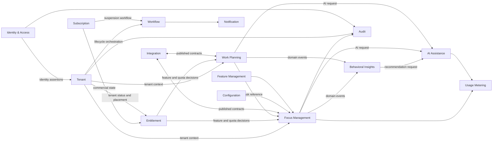

# Domain-Driven Design and Bounded Contexts

**Document ID:** DDD-001  
**Version:** 1.0  
**Status:** Approved  
**Owner:** Chief Architect  
**Scope:** Cloud Native AI Platform and DeepFocus reference product

## 1. Executive Summary

The platform will be designed around business capabilities rather than technical layers. Domain-Driven Design (DDD) is used to identify stable business boundaries, assign ownership, define authoritative data sources, and prevent the platform from becoming a collection of tightly coupled services.

The initial implementation should remain a modular monolith where practical. Bounded contexts are logical and ownership boundaries first; they become independently deployable services only when scale, release independence, security isolation, or team autonomy justifies extraction.

The design separates:

- platform control-plane capabilities;
- product data-plane capabilities;
- shared enabling capabilities;
- infrastructure and commodity capabilities.

DeepFocus is the first reference product. The architecture remains extensible enough to support future products such as observability, incident management, knowledge management, and AI automation without forcing those concerns into the DeepFocus domain model.

## 2. Strategic Domain Classification

### 2.1 Core domains

Core domains differentiate the product and deserve the strongest modeling and engineering investment.

| Domain | Strategic value | Current role |
|---|---|---|
| Focus Management | Primary customer value | Owns focus sessions, timers, interruptions, goals, and completion outcomes |
| Work Planning | Product differentiation | Owns tasks, priorities, estimates, and planned focus work |
| Behavioral Insights | Product differentiation | Converts activity into private, actionable productivity insights |
| AI Assistance | Future differentiation | Provides recommendations, summaries, planning support, and governed agent workflows |

### 2.2 Supporting domains

| Domain | Responsibility |
|---|---|
| Tenant Management | Customer organizations, lifecycle, placement, isolation policy |
| Subscription | Plans, trials, renewals, billing state |
| Entitlement | Feature access, quotas, contractual capabilities |
| Workflow | Durable orchestration of long-running platform processes |
| Notification | Email, push, templates, delivery preferences, retries |
| Integration | Webhooks, connectors, inbound and outbound integration contracts |
| Audit | Security and administrative evidence |
| Usage Metering | Consumption, quotas, usage reporting, cost allocation |
| Configuration | Versioned platform and tenant configuration |
| Feature Management | Controlled release and tenant-specific enablement |

### 2.3 Generic domains

These capabilities should normally be adopted rather than custom-built:

- authentication protocol implementation;
- relational storage;
- message transport;
- object storage;
- secrets management;
- telemetry collection;
- CI/CD and GitOps;
- search infrastructure;
- email and push delivery providers.

Keycloak, PostgreSQL, Kafka, Redis, OpenTelemetry, Kubernetes, and managed cloud services provide generic capabilities. Platform code integrates and governs them but does not reimplement them.

## 3. Bounded Context Catalogue

### 3.1 Identity and Access Context

**Purpose:** Authenticate human and workload identities and issue trusted security assertions.

**Authoritative for:**

- credentials and authentication state;
- external identity-provider federation;
- organization membership representation;
- sessions, MFA, and identity assurance;
- OAuth clients and workload identities.

**Not authoritative for:** tenant commercial status, subscriptions, entitlements, or business permissions.

**Primary implementation:** Keycloak with a thin identity integration layer where product-specific orchestration is needed.

**Key events:**

- `IdentityUserRegistered`
- `IdentityUserDisabled`
- `OrganizationMembershipChanged`
- `ExternalIdentityProviderConfigured`
- `AuthenticationRiskDetected`

### 3.2 Tenant Context

**Purpose:** Maintain the authoritative tenant registry and tenant lifecycle.

**Aggregate root:** `Tenant`

**Entities:** `TenantRegionPlacement`, `TenantIdentityBinding`, `TenantAdministratorInvitation`

**Value objects:** `TenantId`, `TenantName`, `TenantStatus`, `IsolationPolicy`, `HomeRegion`

**Commands:**

- `RegisterTenant`
- `ActivateTenant`
- `SuspendTenant`
- `BeginTenantDeletion`
- `ChangeTenantIsolationPolicy`
- `AssignTenantHomeRegion`

**Events:**

- `TenantRegistered`
- `TenantProvisioningRequested`
- `TenantActivated`
- `TenantSuspended`
- `TenantDeletionRequested`
- `TenantDeleted`

**Invariants:**

- tenant identifiers are immutable;
- a deleted tenant cannot be reactivated;
- only active tenants may process normal data-plane traffic;
- isolation policy changes require a controlled migration workflow.

### 3.3 Subscription Context

**Purpose:** Manage commercial agreements and lifecycle.

**Aggregate root:** `Subscription`

**Entities:** `Plan`, `Trial`, `BillingAccount`, `Renewal`

**Value objects:** `SubscriptionId`, `BillingPeriod`, `SubscriptionStatus`, `Money`

**Events:**

- `SubscriptionStarted`
- `SubscriptionRenewed`
- `SubscriptionPaymentFailed`
- `SubscriptionSuspended`
- `SubscriptionCancelled`

The Subscription Context determines commercial state; it does not directly authorize product operations.

### 3.4 Entitlement Context

**Purpose:** Translate commercial agreements into enforceable product capabilities.

**Aggregate root:** `EntitlementSet`

**Entities:** `FeatureGrant`, `Quota`, `ContractOverride`

**Value objects:** `FeatureKey`, `Limit`, `EntitlementSource`, `EffectivePeriod`

**Commands:**

- `GrantEntitlement`
- `RevokeEntitlement`
- `SetQuota`
- `ApplyContractOverride`

**Events:**

- `EntitlementGranted`
- `EntitlementRevoked`
- `QuotaChanged`
- `EntitlementSetRecalculated`

**Authorization doctrine:** access requires valid identity, tenant membership, business permission, active tenant, and required entitlement.

### 3.5 Focus Management Context

**Purpose:** Own the core focus-session lifecycle.

**Aggregate root:** `FocusSession`

**Entities:** `TimerState`, `Interruption`, `SessionOutcome`

**Value objects:** `FocusSessionId`, `Duration`, `SessionMode`, `TimerStatus`, `CompletionReason`

**Commands:**

- `StartFocusSession`
- `PauseFocusSession`
- `ResumeFocusSession`
- `CompleteFocusSession`
- `SkipInterval`
- `RecordInterruption`

**Events:**

- `FocusSessionStarted`
- `FocusSessionPaused`
- `FocusSessionResumed`
- `FocusSessionCompleted`
- `FocusSessionAbandoned`
- `InterruptionRecorded`

**Invariants:**

- a user has at most one active focus session within the same workspace unless policy explicitly allows otherwise;
- state transitions follow a valid timer state machine;
- timer truth is server-authoritative for synchronized sessions;
- commands are idempotent and version-aware to avoid conflicting client updates.

### 3.6 Work Planning Context

**Purpose:** Manage tasks and planned work independently of timer mechanics.

**Aggregate root:** `Task`

**Entities:** `ChecklistItem`, `TaskEstimate`, `TaskAssignment`

**Value objects:** `TaskId`, `Priority`, `TaskStatus`, `Estimate`, `DueDate`

**Events:**

- `TaskCreated`
- `TaskScheduled`
- `TaskAssignedToFocusSession`
- `TaskCompleted`
- `TaskArchived`

The Focus Management Context references tasks by immutable identifier but does not own task content.

### 3.7 Behavioral Insights Context

**Purpose:** Produce privacy-preserving summaries and recommendations from product activity.

**Models:** `ProductivityProfile`, `DailySummary`, `FocusTrend`, `Recommendation`

This is primarily a read-model and analytical context. It consumes published events and must not mutate source aggregates.

**Events produced:**

- `InsightGenerated`
- `RecommendationGenerated`
- `WeeklySummaryPrepared`

### 3.8 AI Assistance Context

**Purpose:** Govern AI-assisted experiences without coupling domain services directly to model providers.

**Aggregate roots:** `AIAssistantPolicy`, `AgentRun`, `EvaluationDefinition`

**Entities:** `PromptTemplate`, `ModelRoute`, `ToolGrant`, `EvaluationResult`

**Events:**

- `AgentRunRequested`
- `AgentRunCompleted`
- `AgentRunFailed`
- `ModelEvaluationCompleted`
- `HumanApprovalRequested`

**Boundary rule:** AI output is advisory unless an explicitly approved workflow grants execution authority. Domain commands remain validated by the owning bounded context.

### 3.9 Workflow Context

**Purpose:** Execute durable, retryable, long-running platform processes.

Initial workflows include:

- tenant provisioning;
- tenant deletion;
- customer identity-provider onboarding;
- data export;
- subscription suspension;
- enterprise tenant migration.

The Workflow Context coordinates but does not become the system of record for domain state.

### 3.10 Notification Context

**Purpose:** Deliver messages through configured channels.

**Aggregate root:** `NotificationRequest`

**Entities:** `DeliveryAttempt`, `TemplateVersion`, `NotificationPreference`

**Events:**

- `NotificationAccepted`
- `NotificationDelivered`
- `NotificationDeliveryFailed`
- `NotificationSuppressed`

### 3.11 Integration Context

**Purpose:** Protect the core model from customer-specific and provider-specific contracts.

Responsibilities include:

- webhook subscriptions;
- external connector configuration;
- payload transformation;
- credential references;
- delivery retries and dead letters;
- inbound contract validation.

Provider adapters form an anti-corruption layer around external systems.

### 3.12 Audit Context

**Purpose:** Store immutable or tamper-evident evidence of sensitive actions.

**Audit subjects:**

- identity and access changes;
- tenant administration;
- subscription and entitlement changes;
- data exports and deletion;
- privileged support access;
- security decisions;
- critical configuration changes.

Audit is not a replacement for application logging.

### 3.13 Usage Metering Context

**Purpose:** Record measurable consumption and enforce quotas.

**Models:** `UsageRecord`, `UsageCounter`, `QuotaWindow`, `BillingExport`

Usage records must identify tenant, capability, unit, time window, and idempotency key.

### 3.14 Configuration Context

**Purpose:** Own validated, versioned, and auditable configuration.

Configuration precedence:

1. platform default;
2. environment policy;
3. plan or edition default;
4. tenant override;
5. temporary operational override.

Business-critical state must not be hidden in configuration.

### 3.15 Feature Management Context

**Purpose:** Control exposure and rollout of product behavior.

Feature flags support tenant targeting, staged rollout, emergency disablement, expiration, and audit. They must not replace authorization or entitlement checks.

## 4. Context Map



## 5. Context Relationship Patterns

| Upstream | Downstream | Pattern | Contract |
|---|---|---|---|
| Identity & Access | Tenant and all protected contexts | Open Host Service + Published Language | OIDC/OAuth claims and identity events |
| Tenant | Product contexts | Customer/Supplier | Tenant status, placement, and isolation contracts |
| Subscription | Entitlement | Customer/Supplier | Commercial-state events |
| Entitlement | Product contexts | Open Host Service | Entitlement decision API and change events |
| Work Planning | Focus Management | Customer/Supplier | Task identity and status contracts |
| Product contexts | Behavioral Insights | Published Language | Versioned domain events |
| AI Assistance | Model providers | Anti-Corruption Layer | Provider-neutral model and tool interfaces |
| Integration | External systems | Anti-Corruption Layer | Provider-specific adapters |
| Workflow | Domain contexts | Orchestration with explicit commands | Durable workflow contracts |

Shared kernels are discouraged. A shared kernel may be used only for primitive platform types such as `TenantId`, correlation metadata, and event-envelope interfaces, and must not contain domain behavior.

## 6. Ubiquitous Language

| Term | Definition |
|---|---|
| Tenant | A customer organization or workspace with an immutable platform identity |
| Organization | Identity-provider representation of a tenant; not the commercial system of record |
| Member | A human identity associated with a tenant |
| Focus Session | A bounded period of intentional work governed by a timer state machine |
| Task | A unit of planned work independent of session execution |
| Subscription | Commercial agreement between platform and customer |
| Entitlement | Effective permission to use a product capability or quota |
| Isolation Policy | Storage and runtime placement model assigned to a tenant |
| Home Region | Region in which a tenant's authoritative data resides |
| Agent Run | Governed execution of an AI assistant or autonomous workflow |
| Audit Record | Immutable evidence of a security-relevant or administrative action |
| Usage Record | Idempotent measurement of billable or quota-relevant consumption |

Teams must use these terms consistently in code, APIs, events, documentation, and product language.

## 7. Aggregate Design Rules

- Transactions do not cross aggregate boundaries.
- Aggregates expose behavior, not unrestricted state mutation.
- Aggregate identifiers are globally unique and immutable.
- Tenant-owned aggregates always contain immutable `TenantId`.
- Domain events are raised only after aggregate invariants are satisfied.
- External side effects occur through application services, outbox records, or workflows.
- Large collections are modeled as separate aggregates or queried through read models.
- Cross-context references use identifiers, never shared ORM entities.
- Optimistic concurrency is required for frequently updated aggregates such as `FocusSession`.

## 8. Command and Query Separation

Commands express intent and may change authoritative state. Queries use read-optimized models and cannot mutate domain state.

Examples:

| Command | Owning context | Result |
|---|---|---|
| `StartFocusSession` | Focus Management | Accepted state transition and event |
| `CreateTask` | Work Planning | New task aggregate |
| `RegisterTenant` | Tenant | Registered tenant and provisioning request |
| `GrantEntitlement` | Entitlement | Updated entitlement set |
| `RequestAgentRun` | AI Assistance | Governed AI execution |

Read models may combine data from multiple contexts for dashboards, but they are disposable projections and never become the authoritative source.

## 9. Domain Event Standard

Every integration event uses a standard envelope:

```json
{
  "eventId": "uuid",
  "eventType": "FocusSessionCompleted",
  "eventVersion": 1,
  "occurredAt": "2026-07-12T12:00:00Z",
  "producer": "focus-management",
  "tenantId": "uuid",
  "subjectId": "uuid",
  "correlationId": "uuid",
  "causationId": "uuid",
  "dataClassification": "INTERNAL",
  "payload": {}
}
```

Rules:

- events describe completed facts and use past tense;
- the producer owns the schema and compatibility policy;
- consumers are idempotent;
- tokens and secrets are prohibited in payloads;
- personally identifiable information is minimized;
- event ordering is guaranteed only within an explicitly documented partition key;
- domain events remain internal until translated into stable integration events.

## 10. Ownership and Team Topology

| Team | Primary contexts |
|---|---|
| Identity Platform Team | Identity & Access |
| Core Platform Team | Tenant, Subscription, Entitlement, Configuration, Feature Management |
| DeepFocus Product Team | Focus Management, Work Planning |
| Data and AI Team | Behavioral Insights, AI Assistance |
| Platform Operations Team | Workflow, Notification, Integration, Usage Metering |
| Security Platform Team | Audit controls and security policy integration |
| SRE / Platform Engineering | Kubernetes, delivery platform, telemetry infrastructure, reliability enablement |

Each context has one accountable owner. Supporting teams may contribute, but shared ownership of authoritative state is prohibited.

## 11. Initial Deployment Mapping

Bounded contexts do not imply one microservice each.

### Stage 1: modular monolith

A single Spring Boot deployment may contain:

- Focus Management module;
- Work Planning module;
- Tenant module;
- basic Entitlement module;
- Audit publishing module.

Module boundaries are enforced through package visibility, architecture tests, module APIs, and independent database schemas or table ownership conventions.

Keycloak remains external. Notification providers and telemetry infrastructure remain external.

### Stage 2: first extractions

Extract contexts with distinct operational characteristics:

- Notification workers;
- Workflow engine and workers;
- AI Assistance runtime;
- Integration delivery workers;
- Behavioral Insights projections.

### Stage 3: platform scale

Extract Tenant, Subscription, Entitlement, and Usage Metering when multiple products depend on them or independent scaling and ownership become necessary.

## 12. Extraction Criteria

A module becomes an independently deployable service only when at least one strong driver exists:

- independent scaling profile;
- materially different availability or security tier;
- independent release cadence;
- separate team ownership;
- technology/runtime specialization;
- regulatory or data-isolation requirement;
- repeated operational contention;
- need for reuse by multiple products.

Microservice extraction is not justified by code size alone.

## 13. Data Ownership Matrix

| Data | Authoritative context |
|---|---|
| Credentials, federation, sessions | Identity & Access |
| Tenant status, region, isolation mode | Tenant |
| Plan and billing lifecycle | Subscription |
| Feature access and quotas | Entitlement |
| Timers and focus outcomes | Focus Management |
| Tasks and planning metadata | Work Planning |
| Recommendations and summaries | Behavioral Insights |
| Agent runs and model evaluations | AI Assistance |
| Delivery history | Notification |
| Security and admin evidence | Audit |
| Consumption counters | Usage Metering |
| Versioned settings | Configuration |

No context may update another context's tables directly.

## 14. Principal Risks and Controls

| Risk | Control |
|---|---|
| Platform service becomes a distributed monolith | Explicit contracts, outbox pattern, dependency rules, bounded synchronous chains |
| Keycloak becomes tenant system of record | Tenant Context remains authoritative for lifecycle and commercial status |
| One oversized platform bounded context | Separate Tenant, Subscription, Entitlement, Workflow, and Configuration models |
| Analytics corrupts operational ownership | Insights uses event-fed projections only |
| AI bypasses business rules | AI output translated into validated domain commands |
| Premature microservice sprawl | Modular-first deployment and extraction criteria |
| Shared libraries create hidden coupling | Libraries contain technical primitives, not domain models |
| Cross-tenant leakage | Immutable tenant identifiers, repository enforcement, RLS where applicable, security tests |

## 15. Architecture Fitness Functions

The following checks should become automated:

- bounded-context packages do not import another context's internal packages;
- tenant-owned tables contain non-null `tenant_id`;
- no repository queries tenant-owned data without tenant scope;
- cross-context database foreign keys are prohibited;
- integration events conform to the event envelope and schema registry rules;
- all event consumers implement idempotency;
- domain modules expose explicit application interfaces;
- AI modules cannot directly update product-domain repositories;
- business modules do not depend on Keycloak-specific classes;
- architecture tests detect cyclic module dependencies.

## 16. Key Decisions

1. DDD boundaries represent business ownership, not deployment units.
2. DeepFocus begins as a modular monolith with enforceable context boundaries.
3. Tenant, Subscription, and Entitlement are separate concepts and models.
4. Keycloak owns authentication; the Tenant Context owns tenant lifecycle.
5. Focus Management and Work Planning remain separate contexts.
6. Behavioral Insights consumes events and does not own operational data.
7. AI Assistance is provider-neutral and cannot bypass domain validation.
8. Workflow coordinates long-running processes but does not own domain truth.
9. External provider contracts are isolated through anti-corruption layers.
10. Context extraction requires a measurable operational or organizational driver.

## 17. Review Checklist

- Core, supporting, and generic domains are correctly classified.
- Every authoritative business concept has one owning context.
- Tenant, subscription, entitlement, identity, and organization are not conflated.
- DeepFocus core domains are modeled independently from generic platform concerns.
- Context relationships and contract patterns are explicit.
- Aggregates and invariants protect the most important business rules.
- Domain and integration events are distinguished.
- Deployment boundaries can evolve independently of domain boundaries.
- Team ownership aligns with context ownership.
- AI, analytics, and integrations cannot bypass source-domain rules.
- Extraction criteria prevent premature microservice decomposition.

## 18. Next Architecture Documents

This model is the foundation for:

1. Identity and Access Architecture;
2. Multi-Tenant Architecture;
3. Data Architecture;
4. Integration and Event-Driven Architecture;
5. Platform and Kubernetes Architecture;
6. Security and Zero Trust Architecture.
