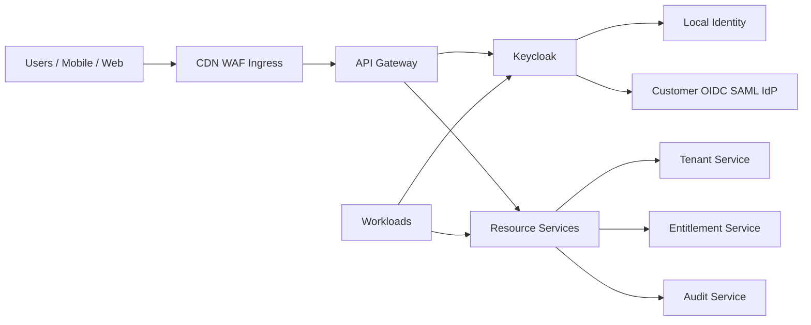
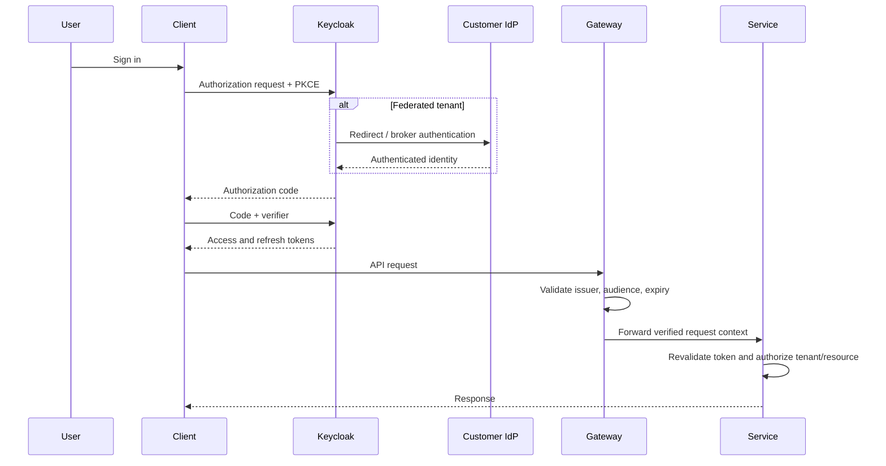
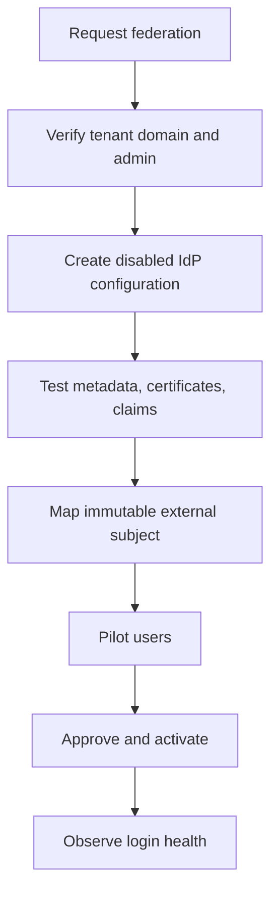

# Identity & Access Architecture

**Document ID:** IAM-001  
**Version:** 1.0  
**Status:** Approved  
**Owner:** Chief Architect / Identity Architect

## 1. Executive Summary

The platform adopts centralized authentication, tenant-aware authorization, and distinct human and workload identities. Keycloak is the identity provider and federation broker, while platform services remain authoritative for tenant lifecycle, commercial state, entitlements, and domain authorization.

The initial topology uses one Keycloak realm with one Organization per customer. The model supports local accounts, enterprise OIDC/SAML federation, MFA, service accounts, short-lived workload credentials, controlled support access, and future SCIM provisioning.

## 2. Goals

- Centralize authentication without centralizing all business authorization.
- Enforce tenant membership and tenant status on every protected request.
- Separate customer, platform-admin, support, workload, automation, and partner identities.
- Support local login and enterprise identity federation.
- Eliminate shared service credentials and long-lived secrets where practical.
- Make privileged access temporary, approved, visible, and fully auditable.
- Provide resilient identity operations, recovery, and lifecycle governance.

## 3. Scope

Included:

- Authentication and federation
- User and organization membership
- OAuth2/OIDC and SAML
- MFA and session management
- RBAC, ABAC, entitlements, and resource authorization
- Service-to-service identity
- Support access and break-glass procedures
- Identity lifecycle, SCIM, audit, and recovery

Excluded:

- Domain-specific business rules
- Billing and subscription ownership
- Tenant lifecycle authority
- Fine-grained data policies owned by business bounded contexts

## 4. Identity Classes

| Identity class | Examples | Primary controls |
|---|---|---|
| Customer human | Individual user, tenant admin | OIDC, MFA, tenant membership |
| Platform human | Operator, architect, SRE | Separate admin identity, MFA, JIT elevation |
| Support human | Customer support engineer | Approval, scoped impersonation, expiry, audit |
| Workload | API, worker, scheduler | Dedicated service account, restricted audience |
| Automation | CI/CD, provisioning workflow | Federated identity, short-lived credentials |
| External system | Partner API, webhook sender | OAuth client, mTLS, signed requests where needed |
| Emergency | Break-glass operator | Offline protection, dual control, mandatory review |

Human identities and workload identities must never share clients, credentials, roles, or token policies.

## 5. Authoritative Systems

| Concept | Authority |
|---|---|
| Authentication credential and session | Keycloak |
| External IdP connection | Keycloak, configured through platform control plane |
| Organization membership representation | Keycloak |
| Internal tenant identifier and lifecycle | Tenant Context |
| Subscription status | Subscription Context |
| Feature access and limits | Entitlement Context |
| Resource ownership and domain permissions | Owning business context |
| Privileged access approvals | Platform Administration / Security |
| Security audit record | Audit Context |

Keycloak Organizations represent identity grouping, but do not determine whether a tenant is commercially active, suspended, deleted, or entitled to a feature.

## 6. Logical Architecture



The gateway validates tokens and applies coarse access controls. Every resource service independently validates token signature, issuer, audience, expiry, scopes, tenant context, and domain permissions.

## 7. Keycloak Topology

### 7.1 Initial model

- One production realm for the platform.
- One Keycloak Organization per customer tenant.
- Separate clients for web, mobile, gateway, admin console, and each workload.
- Separate administrative realm or isolated admin access path where operationally justified.
- Highly available Keycloak replicas with an external highly available PostgreSQL database.

### 7.2 Dedicated identity option

A dedicated realm or deployment is allowed only for contractual, regulatory, residency, or extreme isolation requirements. It requires an ADR because it increases upgrade, monitoring, recovery, federation, and configuration complexity.

## 8. Authentication Flows

### 8.1 Interactive user login

Use Authorization Code Flow with PKCE for browser and mobile clients.



### 8.2 Service-to-service

Use OAuth2 Client Credentials initially. Each deployable workload receives:

- Dedicated Kubernetes ServiceAccount
- Dedicated OAuth client or federated workload identity
- Narrow scopes
- Restricted audiences
- Short token lifetime
- No shared secret across services

Target evolution is Kubernetes/cloud workload federation using signed service-account tokens or cloud-native workload identity, reducing stored client secrets.

### 8.3 Token exchange

Token exchange is permitted only when a downstream service must receive a narrower token, different audience, or delegated identity. Blind propagation of user tokens across long service chains is prohibited.

## 9. Token Model

Mandatory claims:

- `iss`
- `sub`
- `aud`
- `exp`
- `iat`
- `jti`
- `scope`
- verified internal `tenant_id` for tenant-bound requests
- actor type

Optional claims:

- organization membership
- coarse roles
- authentication strength
- session identifier

Tokens must not contain sensitive profile data, commercial details, dynamic resource permissions, or full entitlement catalogs.

Recommended defaults:

| Token | Initial policy |
|---|---|
| Access token | 5–15 minutes |
| Refresh token | Rotated, client-specific, revocable |
| Admin session | Shorter lifetime, MFA required |
| Workload token | 5 minutes where supported |
| Invitation token | Single use, purpose bound, time limited |

## 10. Authorization Model

Authorization is layered:

```text
Authenticated identity
AND valid issuer and audience
AND active tenant
AND tenant membership
AND coarse platform role
AND feature entitlement
AND resource ownership or domain permission
AND current business rule
```

### 10.1 RBAC

Use roles for stable job functions such as:

- tenant-member
- tenant-admin
- billing-admin
- platform-operator
- support-agent
- security-admin

Avoid creating roles for every resource instance or feature flag.

### 10.2 ABAC

Use attributes for contextual decisions such as:

- tenant ID
- region
- authentication strength
- data classification
- resource owner
- support-access grant
- device or network risk

### 10.3 Entitlements

Entitlements come from the Entitlement Context, not Keycloak roles. A user may be authorized but still denied because the tenant lacks the feature, quota, subscription state, or regional option.

## 11. Tenant Context

The internal tenant identifier is immutable and generated by the Tenant Context. Tenant context may be represented in the token only after trusted mapping from Keycloak Organization membership.

Controls:

- Clients cannot supply or override the effective tenant ID.
- Gateway-provided headers are signed or stripped and recreated.
- Services derive tenant context from verified identity or trusted internal context.
- Repository and persistence layers require tenant context explicitly.
- Cross-tenant operations require a separately authorized platform-admin path.

## 12. Enterprise Federation

Supported protocols:

- OIDC
- SAML 2.0
- Future SCIM 2.0 for provisioning

Federation onboarding workflow:



Requirements:

- Domain ownership verification
- Validated redirect URIs and certificates
- Explicit claim mapping
- Safe rollback to local admin access
- Tenant-specific login diagnostics
- Audit of every configuration change

## 13. Account Linking

Automatic linking by email alone is prohibited for untrusted providers.

Allowed approaches:

- Explicit authenticated linking by the existing user
- Admin-approved linking
- Verified enterprise-domain linking with strict policy
- Immutable external subject mapping

Sensitive tenants may disable linking entirely.

## 14. MFA and Authentication Strength

MFA is mandatory for:

- Platform administrators
- Security administrators
- Support access
- Break-glass use
- Tenant administrators where enterprise policy requires it
- Sensitive operations such as export, identity-provider changes, or key rotation

Step-up authentication is required when the current session does not meet the assurance level of the requested action.

Preferred authenticators:

- Passkeys / WebAuthn
- TOTP
- Enterprise IdP MFA

SMS is a fallback only where risk and regulation permit.

## 15. Privileged Access

### 15.1 Administrative separation

Platform administration uses separate identities from ordinary customer accounts. Shared administrative accounts are prohibited.

### 15.2 Just-in-time elevation

Privileged roles should be temporary and require:

- Reason
- Ticket or case reference
- Approval for sensitive privileges
- Time-bound grant
- MFA
- Complete audit

### 15.3 Support impersonation

Support staff do not silently authenticate as customers. The platform issues a scoped support session with:

- Tenant consent or authorized approval
- Visible banner
- Read-only default
- Explicit allowed actions
- Short expiry
- Audit of views and mutations
- Immediate revocation

### 15.4 Break-glass access

Break-glass credentials are offline protected, regularly tested, monitored, and reviewed after every use. Use triggers an immediate security alert and post-incident review.

## 16. Identity Lifecycle

### Join

- Invitation or approved federation
- Tenant membership assignment
- Required MFA enrollment
- Terms and privacy acceptance
- Audit event

### Move

- Role changes
- Organization membership changes
- Entitlement-aware access recalculation
- Session revocation for sensitive changes

### Leave

- Disable access promptly
- Revoke sessions and refresh tokens
- Remove tenant membership
- Rotate affected shared integration credentials
- Preserve audit history according to policy

### Tenant termination

Identity cleanup is coordinated by a durable workflow and covers users, memberships, IdP configuration, sessions, service clients, cached identity data, and retained audit evidence.

## 17. SCIM Provisioning

SCIM is an enterprise capability, introduced after federation maturity.

Supported operations:

- Create, update, disable users
- Manage groups
- Map groups to tenant roles through governed rules
- Reconcile drift
- Preserve immutable external identifiers

Deletion defaults to disablement until retention and legal requirements allow final removal.

## 18. Secrets and Keys

- Secrets are stored in Vault or a cloud secrets manager.
- Kubernetes External Secrets or equivalent synchronizes runtime secrets.
- Keycloak signing keys rotate under controlled policy.
- Services cache JWKS with bounded TTL and safe refresh behavior.
- No client secret is stored in source, images, ConfigMaps, or plain Helm values.
- Prefer asymmetric client authentication, mTLS, or workload federation over static shared secrets.

## 19. Resilience and Failure Modes

| Failure | Expected behavior |
|---|---|
| Keycloak unavailable | Existing valid access tokens continue until expiry; new login/refresh fails gracefully |
| Customer IdP unavailable | Failure isolated to that tenant; local emergency admin remains available where policy permits |
| JWKS refresh failure | Use valid cached keys within bounded policy; alert on sustained failure |
| Tenant service unavailable | Fail closed for sensitive authorization; limited cached status only with explicit TTL |
| Entitlement service unavailable | Fail closed for premium/sensitive actions; defined degradation for noncritical reads |
| Token revocation delay | Short token lifetimes and session-event processing reduce exposure |
| Compromised workload | Revoke client/federation trust, rotate credentials, isolate pod, investigate audit trail |

## 20. Audit and Monitoring

Audit events include:

- Login success and failure
- MFA enrollment and reset
- Password and credential changes
- Session revocation
- Organization membership changes
- Role and policy changes
- IdP configuration changes
- Account linking
- Service-client lifecycle
- Support impersonation
- Break-glass access

Metrics include login latency, failure rate, token issuance, federation failures by tenant, active sessions, refresh failures, suspicious linking attempts, privileged-role grants, and policy denials.

No passwords, secrets, complete access tokens, refresh tokens, or sensitive claims may be logged.

## 21. Security Controls

- PKCE for public clients
- Exact redirect URI allowlists
- Secure, HttpOnly, SameSite cookies for browser sessions
- CSRF protection where cookies are used
- Rate limiting and bot protection on authentication endpoints
- Brute-force detection
- MFA and step-up authentication
- Token audience validation in every service
- Session revocation for critical changes
- Dedicated clients and ServiceAccounts per workload
- Regular access reviews
- Penetration tests for cross-tenant and federation attack paths

## 22. Implementation Standards

Every Spring resource service must:

- Use Spring Security resource-server validation
- Validate issuer and audience
- Reject missing or ambiguous tenant context
- Map only approved claims
- Perform domain authorization locally
- Emit standardized denial events and metrics
- Propagate trace and correlation IDs without forwarding sensitive tokens to logs or events

A reusable security starter should provide default validation, tenant context resolution, audit hooks, method-security support, test fixtures, and policy compliance checks.

## 23. Architecture Fitness Functions

- Every deployable workload has a dedicated Kubernetes ServiceAccount.
- No production workload uses the default ServiceAccount.
- Every protected API validates audience.
- Public clients use Authorization Code with PKCE.
- Tenant context cannot be supplied by an untrusted client header.
- Privileged roles have MFA and expiry policies.
- Shared OAuth clients across unrelated services are prohibited.
- Secrets scanning finds no credentials in source or manifests.
- Cross-tenant authorization tests run in CI.
- Support impersonation always produces an audit record.

## 24. Delivery Roadmap

### Phase 1 — Secure baseline

- One realm and Organizations
- Web/mobile Authorization Code + PKCE
- Gateway and backend token validation
- Tenant membership mapping
- Basic RBAC
- Dedicated workload clients
- Identity audit events

### Phase 2 — Enterprise operations

- MFA and step-up policies
- JIT privileged access
- Support impersonation
- Identity health dashboards
- Automated secret rotation
- Resilient Keycloak deployment and restore testing

### Phase 3 — Federation

- Customer OIDC
- SAML
- Domain verification
- Safe account-linking policy
- Federation diagnostics and rollback

### Phase 4 — Advanced workload identity

- Kubernetes/cloud workload federation
- Token exchange
- mTLS for selected integrations
- Automated credential lifecycle

### Phase 5 — Enterprise provisioning

- SCIM
- Group-to-role governance
- Periodic access certification
- Advanced risk-based and passwordless authentication

## 25. Risks and Mitigations

| Risk | Mitigation |
|---|---|
| Keycloak becomes a shared failure point | HA, capacity tests, short-lived self-contained tokens, restore exercises |
| Cross-tenant claim mapping error | Immutable tenant IDs, backend validation, security tests |
| Account takeover through linking | No email-only linking, explicit proof and audit |
| Broad workload tokens | Per-service clients, audiences, scopes, short TTL |
| Admin privilege abuse | Separate identities, JIT elevation, MFA, audit |
| Federation misconfiguration | Staged activation, domain verification, rollback |
| Secret sprawl | External secrets, federation, automated rotation |
| Authorization logic centralized incorrectly | Domain services retain resource and business authorization |

## 26. Review Checklist

- Keycloak and platform service authorities are clearly separated.
- Human, workload, support, automation, and partner identities are distinct.
- One-realm Organization model is accepted for the initial platform.
- Tenant context is immutable and verified.
- RBAC, ABAC, entitlement, and domain authorization responsibilities are separated.
- Interactive and M2M flows use appropriate OAuth patterns.
- Federation, account linking, MFA, SCIM, and lifecycle controls are defined.
- Privileged and support access are temporary and auditable.
- Failure behavior, monitoring, recovery, and fitness functions are defined.

## 27. Approved Position

The platform will use Keycloak as the central authentication and federation layer, with one realm and one Organization per customer initially. Keycloak does not own tenant commercial state, entitlements, or domain authorization. Every service validates identity independently, applies tenant-aware authorization, and uses a distinct workload identity. Privileged access is temporary and auditable, while enterprise federation and SCIM are introduced incrementally after the secure baseline is proven.